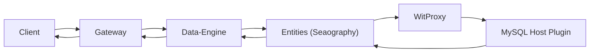
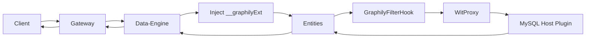
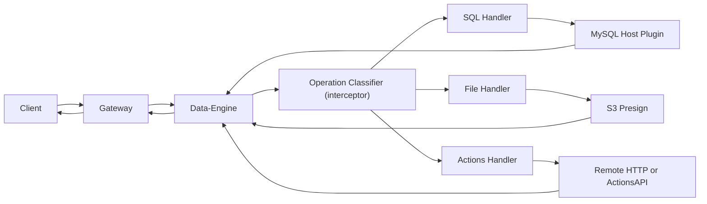

# Query Flows & Operations

Graphily uses three high-level execution paths. The **Data-Engine** inspects the request and routes it to the correct path based on the operation type and filter complexity.

1. **Native** — Path A: Native Seaography (Standard CRUD)
2. **Non-Native** — Path B: Non-Native / OR-Filter Extension
3. **Specialised** — Path C: Specialised Operations (aggregate, upsert, recursive, me, reserve, semantic search)

## Path A: Native Seaography (Standard CRUD)

**What it supports**
- Standard queries and mutations that match the Seaography/SeaORM schema.
- Typical CRUD operations (list, get, create, update, delete) with standard filters, pagination, and sorting.

**Flow**


**Detailed steps (code-backed)**
1. Gateway validates auth, rate limits, and query rules, then forwards the request.
2. Data-Engine parses the operation and classifies it as a Standard query/mutation.
3. Data-Engine normalizes variables and builds the `SecurityContext` (roles, matrices, lenses, row-level settings).
4. Entities receives `GqlRequest`, attaches `SecurityContext`, and executes Seaography resolvers.
5. SeaORM uses `ProxyDatabaseTrait` via `WitProxy` to call the MySQL host plugin over WIT.
6. Data-Engine post-processes the result (field stripping, pagination lift, CRUD wrapping) and returns JSON.

**Example Query**
```graphql
query FilteredUsers($email: String!) {
  allUser(where: { email: { eq: $email } }) {
    totalCount
    results {
      id
      name
      email
    }
  }
}
```

## Path B: Seaography + Non-Native Filters

This path is still Seaography-based, but Data-Engine injects a non-native filter extension that Entities merges into the SQL.

**What it supports**
- Queries that include OR branches or filter operators that Seaography does not express directly.
- Access-matrix permission filters and row-level security that require extra condition branches.

**Flow**


**Detailed steps (code-backed)**
1. Data-Engine detects OR/non-native filters and injects a `__graphilyExt` branch into variables.
2. Entities extracts `__graphilyExt` and stores it as `GraphilyFilterExt` in the request context.
3. `GraphilyFilterHook` merges permission filters, row-level rules, lenses, and `GraphilyFilterExt` into SQL conditions.
4. SeaORM executes via `WitProxy` and the MySQL host plugin; the response returns through Data-Engine.

**Example Query**
```graphql
query {
  allUser(
    where: {
      _or: [
        { email: { contains: "@admin.com" } },
        { name: { eq: "Integration Test" } }
      ]
    }
  ) {
    totalCount
    results {
      id
      name
    }
  }
}
```

## Path C: Specialized SQL Pipeline (Direct Execution)

This path bypasses Seaography and executes specialized logic in Data-Engine, often by generating SQL with `sea-query` and calling the MySQL host plugin directly.

**What it supports**
- **Aggregates**: `countX`, `countDistinctX`, `groupByX`, `distinctX`.
- **Recursive queries**: `recursiveX` with `by`, `id`/`root_id`, optional `ancestors`, and base filters.
- **Upsert**: `upsertX` using `INSERT ... ON DUPLICATE KEY UPDATE`.
- **Reserve**: `reserveX` for ID/slot reservation.
- **Nested mutations**: relationship-aware mutations executed as a single pipeline.
- **File operations**: `generateFileUploadRequest`, `convertFileReference`.

**Flow**


**Detailed steps (code-backed)**
1. Data-Engine classifies the operation (aggregate, recursive, upsert, reserve, nested mutation, file operations).
2. For SQL paths, Data-Engine generates SQL with `sea-query` and calls the MySQL host plugin directly over WIT.
3. For file operations, Data-Engine builds S3 presigned requests and returns the result without Entities.
4. For Actions, Data-Engine calls the in-process Actions library (remote HTTP or ActionsAPI path).

**Example Query**
```graphql
query RecUser($id: Int!) {
  recursiveUser(base_where: { id: { eq: $id } }, by: "id") {
    totalCount
    results {
      id
      name
      email
    }
  }
}
```
