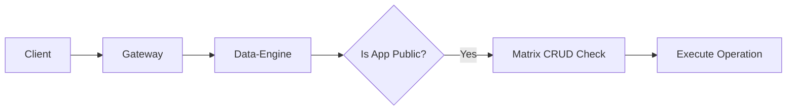
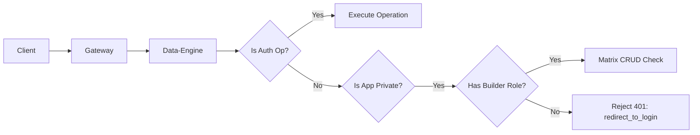

# Application State Gating

Graphily uses the `GRAPHILY_APPLICATION_STATE` environment variable to enforce application-wide access controls. The Data-Engine inspects incoming requests and determines whether to allow access based on the application's current state and the user's role.

There are two primary paths for application state: **Public** and **Private**.

## Path A: Public App State

**What it supports**
- Normal operation according to standard RBAC rules.
- Accessible by any user, including unauthenticated users (subject to the `GRAPHILY_ACCESS_MATRIX` configuration).

**Flow**


**Detailed steps (code-backed)**
1. The `GRAPHILY_APPLICATION_STATE` (or app-specific `GRAPHILY_APPLICATION_STATE_{APP_ID}`) is set to `public`.
2. Data-Engine receives the request and bypasses the private state check.
3. The request proceeds to standard matrix checking (`matrix_crud_check`), where `GRAPHILY_ACCESS_MATRIX` is evaluated to determine if the user has permission to perform the operation.

## Path B: Private App State

**What it supports**
- "Coming soon", "Under maintenance", or "Internal Testing" modes where public access must be disabled.
- Only users with the `builder` role can execute standard operations.
- Non-builders (and unauthenticated users) are immediately denied access with a 401 error (`redirect_to_login`).
- Authentication operations (e.g., `loginUser`) bypass this check so users can authenticate and obtain their roles.

**Flow**


**Detailed steps (code-backed)**
1. The `GRAPHILY_APPLICATION_STATE` (or app-specific `GRAPHILY_APPLICATION_STATE_{APP_ID}`) is set to `private`.
2. Data-Engine parses the request and checks if the operation is an authentication operation (e.g. `loginUser`, `registerUser`) via `op.is_auth_op()`. If true, it allows it to proceed so the user can log in.
3. For standard queries or mutations, Data-Engine inspects the roles extracted from the JWT.
4. If the user possesses the `builder` role, they are permitted to proceed to the standard matrix check.
5. If the user is NOT a `builder`, Data-Engine short-circuits the request and immediately returns a GraphQL error with message `redirect_to_login` and HTTP status `401`.

**Example Configuration**

```sh
# Set globally for all apps (default behavior if unspecified is "public")
GRAPHILY_APPLICATION_STATE=private

# Or set per-app (overrides the global state)
GRAPHILY_APPLICATION_STATE_MY_APP=public
```
