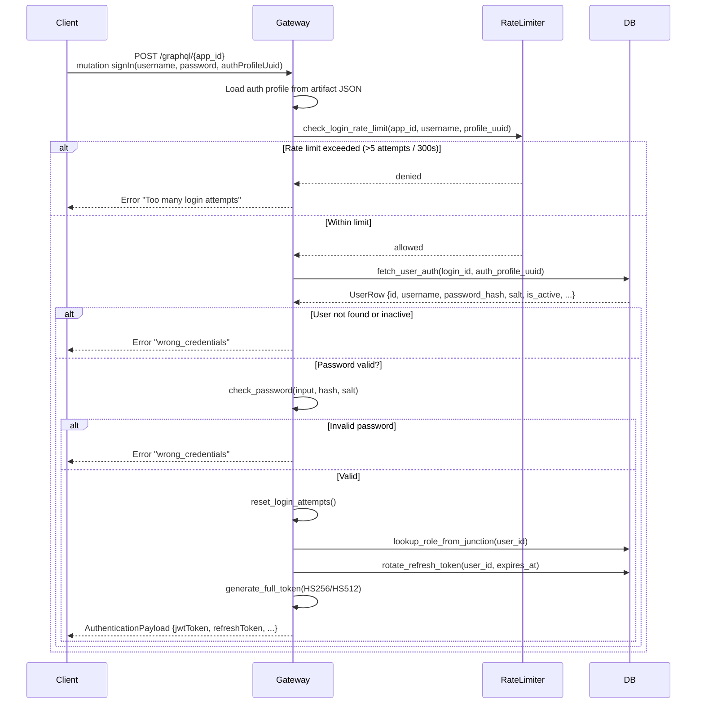
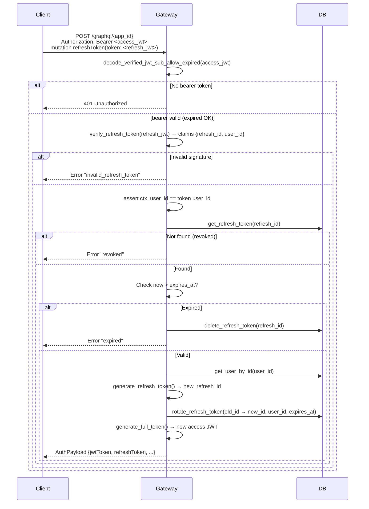
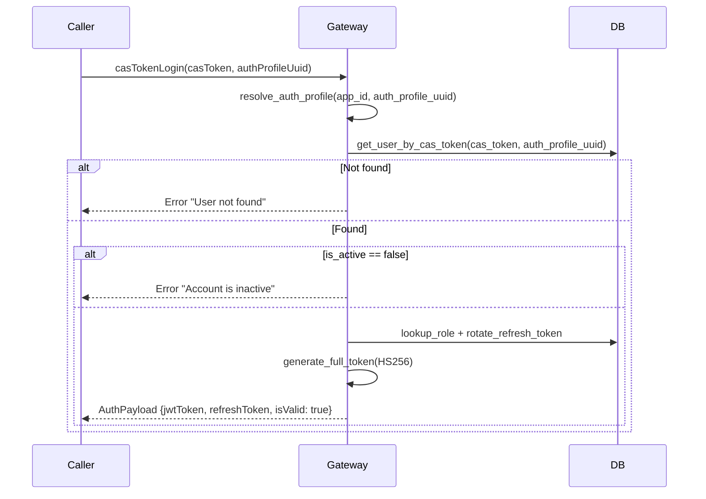
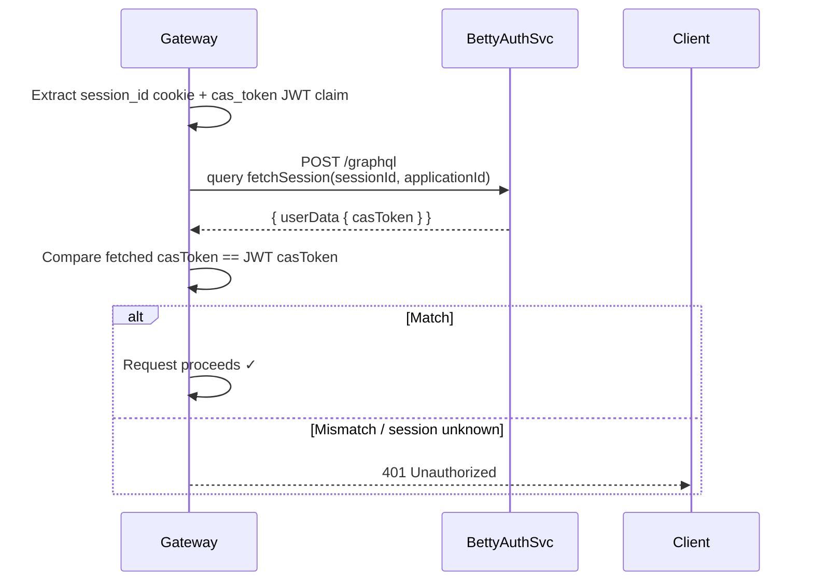
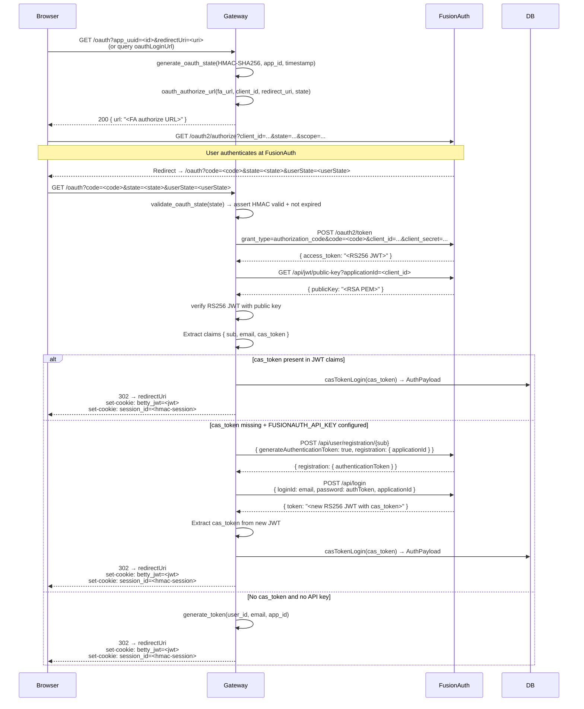
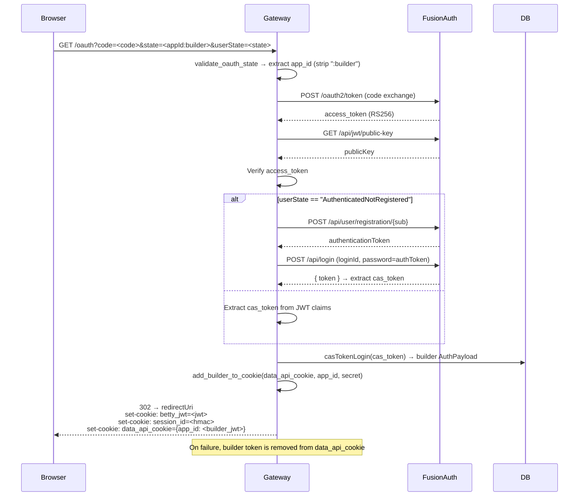
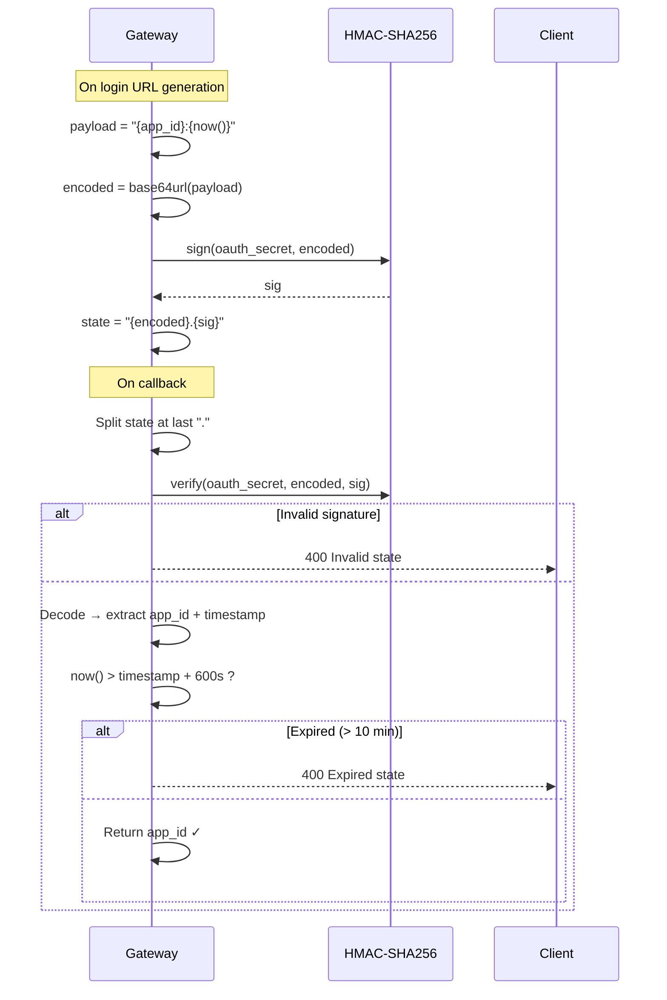

# Authentication

Graphily implements a multi-provider authentication system. Every app has one or more **auth profiles** (stored in the artifact JSON under `authentication_profiles`), and each profile declares a `kind` that selects which auth strategy to use.

---

## Auth Profiles

Auth profiles are loaded at request time from the app artifact:

```json
{
  "authentication_profiles": {
    "<uuid>": {
      "kind": "default | betty_account | fusionauth",
      "redirect_url": "https://myapp.com/dashboard",
      "expiry": {
        "token": 24,
        "refresh": 24
      }
    }
  }
}
```

| Field | Description | Default |
|---|---|---|
| `kind` | Auth strategy to use | `"default"` |
| `redirect_url` | Post-login redirect target | none |
| `expiry.token` | Access token lifetime (hours) | `24` |
| `expiry.refresh` | Refresh token lifetime (hours) | `24` |

A `"default"` profile is always synthesised if no profiles are configured.

---

## HTTP Routes

| Method | Path | Description |
|---|---|---|
| `GET` | `/oauth` | OAuth login-URL initiation **or** OAuth callback |
| `GET` | `/oauth/{*path}` | Wildcard OAuth routes |
| `GET` | `/authentication/callback` | Betty Account SSO callback |
| `PUT` | `/graphql/{app_id}/builder-login` | Builder login URL for Studio |
| `POST` | `/graphql` | App-less GraphQL (Betty auth-service) |
| `POST` | `/graphql/{app_id}` | App-specific GraphQL |

All auth **mutations** are dispatched through the GraphQL endpoint.

---

## GraphQL Auth Mutations

| Mutation name(s) | Purpose |
|---|---|
| `signIn` / `authenticate` / `login` | Username + password login |
| `casTokenLogin` | Login with a pre-issued CAS token |
| `generateJwt` | Issue a JWT for a specific user ID |
| `refreshToken` | Rotate access + refresh tokens |
| `revokeRefreshToken` | Invalidate a refresh token |
| `toCookie` | Encode auth info into a Betty5 cookie |
| `oauthLoginUrl` | Return the FusionAuth OAuth redirect URL |
| `builderLoginUrl` | Return the builder-scoped OAuth redirect URL |
| `oauthCallback` | Complete FusionAuth OAuth code exchange |

---

## 1 — Standard Password Login

**Profile kind:** `"default"` (any profile that is not `betty_account`)

### Request

```graphql
mutation {
  signIn(
    username: "alice"
    password: "secret"
    authProfileUuid: "<profile-uuid>"
  ) {
    jwtToken
    refreshToken
    isValid
    userId
    accessExpiresIn
    accessExpiresAt
    refreshExpiresIn
    refreshExpiresAt
    __typename
  }
}
```

Aliases accepted: `signIn`, `authenticate`, `login`.

### Response

```json
{
  "data": {
    "signIn": {
      "jwtToken": "<signed HS256/HS512 JWT>",
      "refreshToken": "<signed refresh JWT>",
      "isValid": true,
      "userId": 42,
      "accessExpiresIn": 86400,
      "accessExpiresAt": "2026-05-28T12:00:00.000000Z",
      "refreshExpiresIn": 86400,
      "refreshExpiresAt": "2026-05-28T12:00:00.000000Z",
      "__typename": "AuthenticationPayload"
    }
  }
}
```

### Flow



### Error masking

`user_not_found`, `Invalid username or password`, and `wrong_credentials` are all returned to the client as `"wrong_credentials"` to prevent user enumeration.

---

## 2 — Token Refresh

### Request

```graphql
mutation {
  refreshToken(token: "<refresh-jwt>") {
    jwtToken
    refreshToken
    isValid
    accessExpiresIn
    refreshExpiresIn
  }
}
```

The HTTP request **must** carry a valid (or recently-expired) bearer token so the gateway can extract the `user_id` before touching the refresh token.

### Flow



### Revoke refresh token

```graphql
mutation {
  revokeRefreshToken(token: "<refresh-jwt>") {
    refreshId
    removed
  }
}
```

Extracts the `refresh_id` claim and deletes the record from the key-value store. Returns `removed: true` if a row was deleted.

---

## 3 — CAS Token Login

Used internally after a Betty Account or FusionAuth SSO callback has resolved a `cas_token` from the provider.

### Request

```graphql
mutation {
  casTokenLogin(
    casToken: "<token>"
    authProfileUuid: "<uuid>"
  ) {
    jwtToken
    refreshToken
    isValid
  }
}
```

### Flow



---

## 4 — Betty Account SSO

Betty Account is the internal Anthropic SSO provider. It runs as a separate service (`GRAPHILY_AUTH_SERVICE_URL`). The flow uses an OAuth-like handshake where the auth service manages sessions via its own GraphQL API.

**Profile kind:** `"betty_account"`

### Environment variables

| Variable | Description |
|---|---|
| `GRAPHILY_AUTH_SERVICE_URL` | Base URL of the Betty Account auth service |

### Initiation — Login URL

```graphql
mutation {
  signIn(
    callbackUrl: "https://auth-service/authentication/callback"
    redirectUrl: "https://myapp.com/dashboard"
    authProfileUuid: "<betty-profile-uuid>"
  ) {
    redirectUrl
  }
}
```

Or via the GET endpoint:

```
GET /oauth?app_uuid=<app_id>&redirectUri=<uri>
GET /graphql/{app_id}/builder-login?redirectUri=<uri>
```

### Full Betty Account SSO flow

```mermaid
sequenceDiagram
    participant Browser
    participant Gateway
    participant BettyAuthSvc as Betty Auth Service<br/>(GRAPHILY_AUTH_SERVICE_URL)
    participant DB

    Browser->>Gateway: GET /oauth?app_uuid=<id>&redirectUri=<uri>
    Gateway->>BettyAuthSvc: POST /graphql<br/>query fetchLoginUrl(applicationId, callbackUrl, redirectUrl)
    BettyAuthSvc-->>Gateway: { loginUrl: "https://sso.betty.io/login?..." }
    Gateway-->>Browser: 200 { url: "<loginUrl>" }

    Browser->>Browser: Redirect to Betty SSO login page
    Note over Browser: User authenticates at Betty SSO

    BettyAuthSvc-->>Browser: Redirect → GET /authentication/callback?code=<code>&state=<state>&userState=Authenticated

    Browser->>Gateway: GET /authentication/callback?code=<code>&state=<state>&userState=<userState>
    Gateway->>Gateway: Check userState == "Authenticated"?

    alt userState != Authenticated (e.g. AuthenticatedNotRegistered)
        Gateway->>BettyAuthSvc: POST /graphql<br/>mutation cancelLoginSession(applicationId, state)
        BettyAuthSvc-->>Gateway: redirectUrl
        Gateway->>Gateway: build_access_denied_url(redirectUrl)
        Gateway-->>Browser: 302 → denied URL<br/>set-cookie: session_id=; Max-Age=0<br/>set-cookie: betty_jwt=; Max-Age=0
    else userState == Authenticated
        Gateway->>BettyAuthSvc: POST /graphql<br/>mutation createSession(applicationId, accessToken=code, state)
        BettyAuthSvc-->>Gateway: { sessionId, redirectUrl, userData { casToken, email } }
        Gateway->>DB: casTokenLogin(casToken, betty_account profile uuid)
        DB-->>Gateway: UserRow → AuthPayload { jwtToken }
        Gateway-->>Browser: 302 → redirectUrl<br/>set-cookie: betty_jwt=<jwtToken>; HttpOnly=false<br/>set-cookie: session_id=<sessionId>; HttpOnly=true
    end
```

### Session verification (per-request)

On each subsequent request, if the profile kind is `betty_account`, the gateway verifies the session is still live:



---

## 5 — FusionAuth OAuth2/OIDC

FusionAuth is a self-hosted or cloud identity provider. Graphily integrates with it using the **Authorization Code** grant type.

**Scope:** `offline_access openid email profile`

**Token algorithm:** RS256 (FusionAuth issues RS256 JWTs; Graphily fetches the public key to verify them)

### Environment variables

| Variable | Description |
|---|---|
| `FUSIONAUTH_URL` | FusionAuth base URL |
| `FUSIONAUTH_CLIENT_ID` | OAuth application client ID |
| `FUSIONAUTH_CLIENT_SECRET` | OAuth client secret |
| `FUSIONAUTH_API_KEY` | API key for user registration (optional) |

### Initiation — OAuth Login URL

```graphql
query {
  oauthLoginUrl(redirectUri: "https://myapp.com/callback") {
    url
  }
}
```

Returns:
```json
{
  "data": {
    "oauthLoginUrl": {
      "url": "https://fusionauth.example.com/oauth2/authorize?client_id=...&response_type=code&state=<hmac-state>&scope=offline_access+openid+email+profile"
    }
  }
}
```

The `state` parameter is an HMAC-SHA256–signed token with a **10-minute expiry** to prevent CSRF.

### Authorization Code Callback

```
GET /oauth?code=<code>&state=<state>&userState=<userState>&redirectUri=<uri>
```

### Full FusionAuth OAuth2 flow



### GraphQL oauthCallback (non-redirect variant)

```graphql
mutation {
  oauthCallback(code: "<code>", state: "<state>") {
    jwtToken
    refreshToken
    isValid
  }
}
```

This variant goes through the same token exchange and verification but returns the tokens in the GraphQL response body instead of setting cookies and redirecting.

---

## 6 — Builder Authentication

Studio (the builder UI) uses a separate auth cookie (`data_api_cookie`) that carries per-app builder tokens. The builder flows are identical to the user flows above but the state encodes `{app_id}:builder` and the response updates `data_api_cookie`.

### Builder Login URL

```
PUT /graphql/{app_id}/builder-login?redirectUri=<uri>
```

Returns the Betty Account or FusionAuth login URL (same priority logic as user login).

### Builder OAuth callback

Triggered on `GET /oauth` when `state` ends with `:builder`.



### Builder cookie structure

`data_api_cookie` is a JSON map of `app_id → builder_jwt`. Each builder JWT carries `{ builder: true, app_id }`.

```json
{
  "3f2a1b4c-...": "<HS256 builder JWT>",
  "9e8d7f6a-...": "<HS256 builder JWT>"
}
```

---

## 7 — JWT Structure

All tokens (access and refresh) are signed with HS256 by default. The algorithm is configurable via `GRAPHILY_JWT_ALGORITHM`.

### Access token claims

```json
{
  "sub": 42,
  "username": "alice",
  "role": "admin",
  "roles": "[\"admin\",\"editor\"]",
  "app_id": "<app_uuid>",
  "app_uuid": "<app_uuid>",
  "auth_profile": "<profile_uuid>",
  "cas_token": "<betty-cas-token>",
  "builder": null,
  "locale": "en",
  "custom_fields": "{\"department\":\"eng\"}",
  "iat": 1748347200,
  "exp": 1748433600
}
```

### Refresh token claims

```json
{
  "sub": 42,
  "user_id": 42,
  "refresh_id": "<uuid>",
  "app_id": "<app_uuid>",
  "iat": 1748347200,
  "exp": 1748433600
}
```

### Token lifetime

| Variable | Default |
|---|---|
| `GRAPHILY_ACCESS_TOKEN_HOURS` | `24` |
| `GRAPHILY_REFRESH_TOKEN_HOURS` | `24` |

Per-profile `expiry.token` / `expiry.refresh` overrides the global defaults.

### Key rotation

`security::verify()` accepts a list of secrets and tries each in order, enabling zero-downtime secret rotation.

---

## 8 — Cookie & Session Management

Graphily sets up to three cookies after a successful login:

| Cookie | HttpOnly | Contents |
|---|---|---|
| `betty_jwt` | **false** | The user access JWT (readable by JS) |
| `session_id` | **true** | Session identifier (Betty: the SSO session ID; FusionAuth: HMAC of `"session:{jwt}"`) |
| `data_api_cookie` | **true** | Builder token map (only for builder flows) |

Cookie attributes are controlled by:

| Variable | Effect |
|---|---|
| `GRAPHILY_HTTPS=true` | Adds `Secure` flag |
| `SameSite` | Always `Lax` (configurable to `Strict` / `None` via `toCookie` mutation) |

### Betty5 cookie (toCookie mutation)

The `toCookie` mutation returns a legacy Betty5-compatible cookie value for apps that need it:

```graphql
mutation {
  toCookie(sameSite: "Lax") {
    value
    csrf
  }
}
```

The value is Base64-encoded marshal-serialized data with an HMAC-SHA1 signature. It encodes `{ user_id, auth_profile, csrf_token }`.

---

## 9 — OAuth State Security

All OAuth flows use a tamper-proof, time-limited state token to prevent CSRF attacks.

**Format:** `base64url({app_id}:{unix_timestamp}).{hmac_sha256_hex}`



Secret: `GRAPHILY_OAUTH_SECRET`

---

## 10 — Rate Limiting

Login attempts are tracked **in-memory** per `(app_id, username, auth_profile_uuid)` tuple.

| Variable | Default |
|---|---|
| `GRAPHILY_LOGIN_MAX_ATTEMPTS` | `5` |
| `GRAPHILY_LOGIN_WINDOW_SECS` | `300` (5 minutes) |

On success, the attempt counter is reset. On failure with too many attempts the response is:

```json
{"errors": [{"message": "Too many login attempts. Please try again later."}]}
```

> **Note:** The counter is in-memory and is not shared across instances. In a multi-replica deployment, each replica maintains its own counter.

---

## 11 — App Access Control

Before routing a GraphQL request, the gateway checks whether the requesting party may access the app at all:

| `app_state` | `is_builder` | Result |
|---|---|---|
| `non_live` | true | `allow` |
| `non_live` | false | `deny` |
| `sandbox` | any | `sandbox` (read-only data) |
| `live` + public visibility | any | `allow` |
| `live` + private visibility | false | `redirect_oauth` |
| `live` + private visibility | true | `allow` |

---

## 12 — RBAC (Role-Based Access Control)

After authentication, every GraphQL operation is validated against the app's access matrix before hitting the data engine.

```json
{
  "access_matrix": {
    "public": {
      "User": { "read": true, "create": false, "update": false, "delete": false }
    },
    "private": {
      "User": {
        "<role_id>": { "read": true, "update": true }
      }
    }
  }
}
```

The user's `role` (or `roles` array) from the JWT is looked up against this matrix. Permission filters can also inject SQL `WHERE` conditions to restrict which rows a role can see.

---

## 13 — Generate JWT (Admin)

Administrators can generate a JWT for any user without a password:

```graphql
mutation {
  generateJwt(userId: 42, authProfileUuid: "<uuid>") {
    jwtToken
    isValid
  }
}
```

This is intended for server-to-server scenarios and is only available to authenticated callers with appropriate access.

---

## Environment Variable Reference

| Variable | Description | Default |
|---|---|---|
| `GRAPHILY_JWT_SECRET` | HS256/HS512 signing secret | — |
| `GRAPHILY_JWT_ALGORITHM` | `HS256` or `HS512` | `HS256` |
| `GRAPHILY_JWT_REFRESH_ALGORITHM` | Refresh token algorithm | `HS256` |
| `GRAPHILY_ACCESS_TOKEN_HOURS` | Access token lifetime | `24` |
| `GRAPHILY_REFRESH_TOKEN_HOURS` | Refresh token lifetime | `24` |
| `GRAPHILY_COOKIE_SECRET` | Cookie HMAC secret (falls back to `GRAPHILY_JWT_SECRET`) | — |
| `GRAPHILY_OAUTH_SECRET` | OAuth state HMAC secret | — |
| `GRAPHILY_HTTPS` | Set `true` to add `Secure` cookie flag | — |
| `GRAPHILY_AUTH_SERVICE_URL` | Betty Account auth service base URL | — |
| `FUSIONAUTH_URL` | FusionAuth instance base URL | — |
| `FUSIONAUTH_CLIENT_ID` | FusionAuth application client ID | — |
| `FUSIONAUTH_CLIENT_SECRET` | FusionAuth client secret | — |
| `FUSIONAUTH_API_KEY` | FusionAuth API key (for user registration) | — |
| `GRAPHILY_LOGIN_MAX_ATTEMPTS` | Max login attempts before rate-limit | `5` |
| `GRAPHILY_LOGIN_WINDOW_SECS` | Rate-limit window in seconds | `300` |
