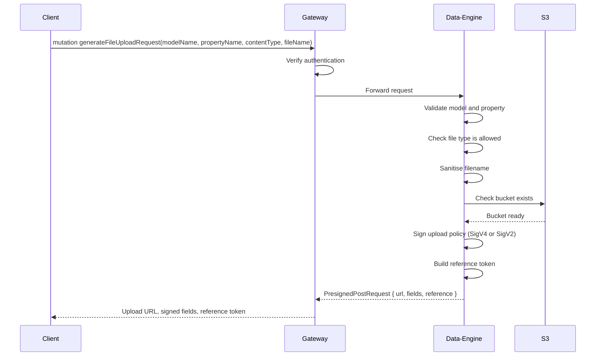
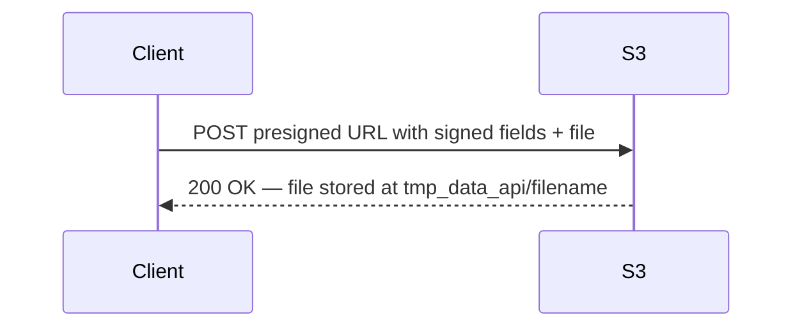
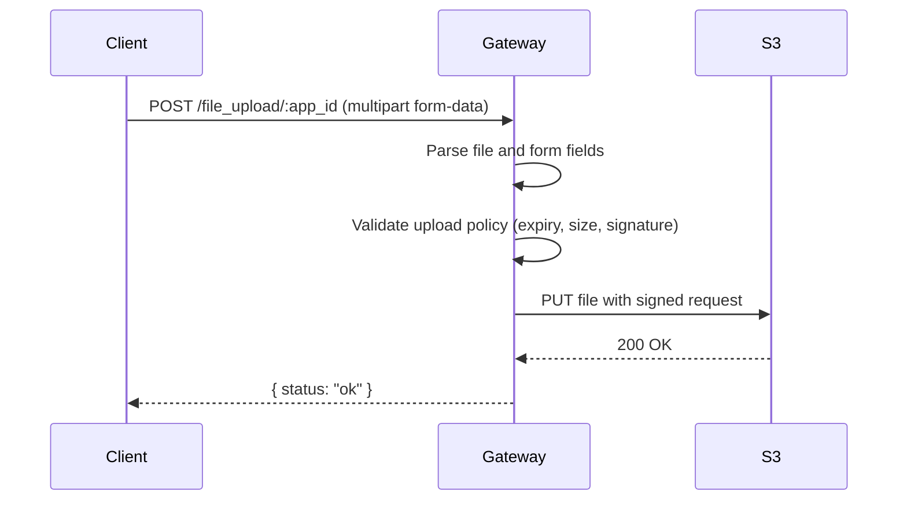
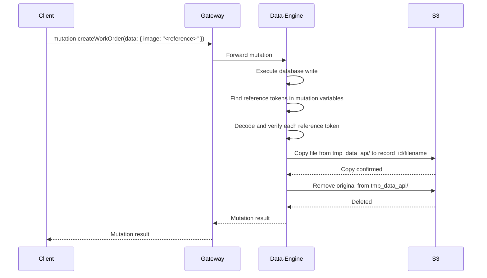
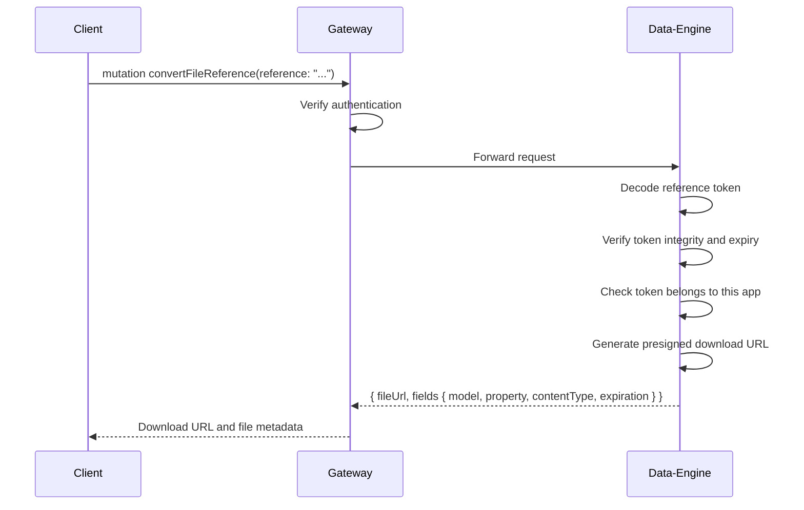

# File Uploads

Graphily supports a full file upload pipeline — from generating a secure upload URL, to automatically moving files when records are created, to converting a reference back into a download link. Binary data never passes through the GraphQL layer.

---

## 1. Generate Upload Request

A client requests a time-limited upload slot for a specific model property. Graphily validates the request, prepares the S3 bucket if needed, and returns everything the client needs to upload directly.

**What it supports**
- Validates that the model and property exist and allow file uploads
- Checks the file type is permitted for that property
- Ensures the upload bucket is ready before issuing the policy
- Returns a signed upload policy, upload URL, and a tamper-proof reference token

**Flow**


**Detailed steps**
1. The client sends a GraphQL mutation naming the model, property, file name, and content type.
2. Gateway checks the request carries a valid session. Unauthenticated requests are turned away immediately.
3. Data-Engine checks that the model exists in the app schema and that the named property is configured to accept file uploads. An unknown model or property returns an error.
4. The file type is checked against the allowed types for that property. If not permitted, the response lists which types are accepted.
5. The file name is cleaned before becoming an S3 key — special characters are removed and a random suffix added to avoid collisions.
6. Data-Engine confirms the upload bucket exists. If missing, it creates the bucket and applies the correct access policy before continuing.
7. A signed upload policy is generated. The signing method is resolved in order: `assets_config.provider` in the artifact (`AWS`/`RADOSGW` → SigV2), then the endpoint URL (legacy Betty Blocks asset hosts → SigV2), defaulting to SigV4.
8. A reference token is created that encodes `key`, `content_type`, `name`, `model`, `property`, `bucket`, `from`, `app`, `expiration`, `version`, and `request`. This token travels with the file through the rest of its lifecycle.
9. The client receives the upload URL, the signed fields to submit alongside the file, and the reference token.

**Example**
```graphql
mutation {
  generateFileUploadRequest(
    modelName: "WorkOrder"
    propertyName: "image"
    contentType: "image/jpeg"
    fileName: "photo.jpg"
  ) {
    ... on PresignedPostRequest {
      url
      fields
      reference
    }
    ... on FileUploadError {
      message
      code
    }
  }
}
```

---

## 2. Upload File to S3

Once the client has the upload URL and fields, it sends the file directly to S3. For environments where a direct browser-to-S3 connection is not possible, the Gateway can act as a proxy.

**What it supports**
- Direct upload — client POSTs the file to the S3 URL returned in step 1
- Proxy upload — client POSTs multipart form data to Graphily, which forwards to S3

**Direct upload flow**


**Proxy upload flow**


**Detailed steps (proxy path)**
1. The client sends the file and form fields to `POST /file_upload/:app_id`.
2. Gateway parses the multipart body to extract the file and the signed fields from step 1.
3. The upload policy is validated — expiry and file size are always checked. If a `Signature` field is present it is also verified; absent signature skips that check. Any failure returns a descriptive error.
4. If validation passes, Gateway sends the file directly to S3 on behalf of the client.
5. A success response is returned once S3 confirms the upload.

---

## 3. Attach File via Mutation

When a create, update, or delete mutation is submitted with a reference token in its variables, Graphily automatically moves the file from its temporary location to its permanent home — no extra step needed from the client.

**What it supports**
- **Create** — moves the uploaded file from the temporary area to a folder tied to the new record
- **Update** — replaces the existing file with the new one; clears the file if the field is nulled
- **Delete** — removes all files associated with the record

**Flow**


**Detailed steps**
1. The client submits a standard create, update, or delete mutation. Reference tokens in any field are detected automatically.
2. Data-Engine writes the record to the database first. File movement only happens after the write succeeds.
3. Data-Engine resolves each reference token to a source location and a destination tied to the new record ID.
4. Each file is copied from the temporary upload area to its permanent home. The copy is retried automatically if S3 is slow.
5. Once the copy is confirmed, the temporary file is removed.
6. For **update** mutations, any previously stored file for that record is removed before the new one moves in.
7. For **delete** mutations, all files stored under that record are removed.
8. The mutation result is returned to the client. File movement is invisible — the response is identical to any other mutation.

---

## 4. Convert File Reference

At any point after a file has been uploaded, the client can exchange a reference token for a time-limited download link.

**What it supports**
- Validates the reference token has not been tampered with or expired
- Returns a presigned download URL for the file
- Returns the file original metadata (model, property, content type, expiry)
- Requires an authenticated session

**Flow**


**Detailed steps**
1. The client sends the reference token received during the upload request.
2. Gateway checks the request carries a valid session. Without authentication the request is rejected with "Not allowed to convert file reference".
3. Data-Engine unpacks the reference token and verifies it has not been altered since it was issued.
4. The token expiry is checked. Expired references are rejected.
5. The token app ID is checked to ensure it belongs to the current application. Cross-app references are rejected.
6. A time-limited download URL is generated for the file at its current storage location — the same temporary bucket and key encoded in the reference token at upload time.
7. The client receives the download URL and the file original metadata.

**Example**
```graphql
mutation {
  convertFileReference(reference: "eNqr...sig") {
    fileUrl
    fields {
      model
      property
      contentType
      expiration
    }
  }
}
```

---

## Supporting Behaviours

### Filename Sanitisation

Every uploaded filename is cleaned before it becomes a storage key. Characters that could interfere with URLs or storage paths are removed, and a random suffix is added to prevent two uploads of the same filename from overwriting each other.

### Signing Version (SigV4 / SigV2)

The upload policy is signed using either SigV4 or SigV2, resolved in this order: `assets_config.provider` in the artifact (`AWS`/`RADOSGW` → SigV2, others → SigV4); legacy Betty Blocks asset hostnames in the endpoint URL → SigV2; default SigV4.

**SigV4 policy fields:** `key`, `Content-Type`, `X-Amz-Algorithm`, `X-Amz-Credential`, `X-Amz-Date`, `Policy`, `X-Amz-Signature`

**SigV2 policy fields:** `key`, `Content-type`, `ACL`, `AWSAccessKeyId`, `policy`, `Signature`

### Image Resize Variants

When `imageSizes` is provided in `generateFileUploadRequest`, Graphily generates a presigned download URL for each image size variant alongside the main upload response. Variant files are expected at `{sizeName}_{filename}` under the record permanent storage folder.

### Bucket Auto-Provisioning

Before issuing an upload policy, Graphily checks that the target bucket exists. If it is missing, it is created and configured with the correct access settings automatically. This step is skipped when an external asset management service is handling storage.

---

## Sample Outputs

### SigV4 — Generate Upload Request
`generateFileUploadRequest` with a SigV4-compatible provider returns `X-Amz-Algorithm`, `X-Amz-Credential`, `X-Amz-Date`, `Policy`, `X-Amz-Signature`.


---

### SigV2 — Generate Upload Request
`generateFileUploadRequest` with an AWS or RadosGW provider returns `ACL`, `AWSAccessKeyId`, `Content-type`, `Signature`, `policy`.


---

### File Type Rejected
Uploading a file type not on the allowed list returns a clear error naming the accepted types.


---

### Convert File Reference
`convertFileReference` returns a time-limited download URL alongside the file original metadata.


---

## Libraries Used

| Library | Version | Purpose |
|---|---|---|
| `aws-sdk-s3` | 1.106 | Bucket management and presigned GET URL generation |
| `aws-smithy-wasm` | 0.1 | WASI-compatible HTTP transport for the AWS SDK |
| `aws-smithy-async` | 1.2 | Async timer support for the AWS SDK inside WASM |
| `hmac` | 0.12 | Policy signing and reference token integrity |
| `mime_guess` | 2.0 | File type validation from MIME types |
| `chrono` | 0.4 | Expiry timestamps for policies and reference tokens |
