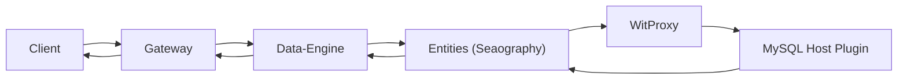
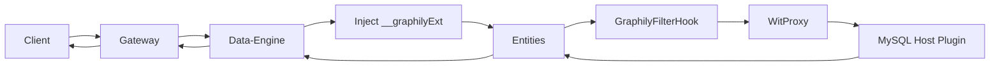
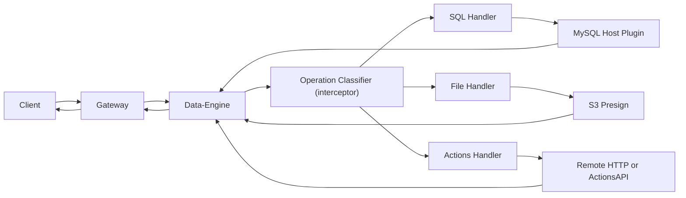

# Query Flows & Operations

Graphily uses three high-level execution paths. The **Data-Engine** inspects the request and routes it to the correct path based on the operation type and filter complexity.

1. **Native** — Path A: Native Seaography (Standard list/get queries)
2. **Non-Native** — Path B: Non-Native / OR-Filter Extension
3. **Specialised** — Path C: Specialised Operations (SimpleCrud, aggregate, upsert, recursive, me, reserve, nested mutation, file operations)

## Path A: Native Seaography (Standard Queries)

**What it supports**
- `allX` (list) and `getX` (get) queries resolved directly by Seaography / SeaORM.
- Native filter operators: `eq`, `neq`, `lt`, `gt`, `lte`, `gte`, `in`, `notIn`, `contains`, `startsWith`, `endsWith`, `isNull`, `isNotNull` — with standard pagination and sorting.
- Mutations that do not match any specialized pattern fall through to this path.

> **Note:** `createX`, `updateX`, and `deleteX` mutations are classified as **Path C** (SimpleCrud), not Path A.

**Flow**


**Detailed steps (code-backed)**
1. Gateway validates auth, rate limits, and query rules, then forwards the request.
2. Data-Engine parses the operation and classifies it as a Standard query.
3. Data-Engine normalizes variables (predicates, operators, sort) — no `__graphilyExt` injection since all operators are native.
4. Data-Engine builds the `SecurityContext` (roles, access matrices, lenses, row-level settings) and forwards the request to Entities.
5. Entities receives the request, attaches `SecurityContext`, and executes Seaography resolvers.
6. SeaORM uses `ProxyDatabaseTrait` via `WitProxy` to call the MySQL host plugin over WIT.
7. Data-Engine post-processes the result (pagination lift, field stripping) and returns JSON.

**Example Query**
```graphql
query FilteredUsers($email: String!) {
  allUser(where: { email: { eq: $email } }) {
    totalCount
    results {
      id
      name
      email
    }
  }
}
```

## Path B: Seaography + Non-Native Filters

This path is still Seaography-based, but Data-Engine detects non-native filter operators in the request variables and injects a `__graphilyExt` branch that `GraphilyFilterHook` inside Entities merges into the SQL.

**What it supports**
- Queries whose variables contain non-native filter operators that Seaography cannot express directly: `or`, `blank`, `notBlank`, `matchesRegexp`, `regexp`, `between`, `equalToDateRange`, `notBetween`, `notEqualToDateRange`, `datePreset`.
- `eq` with a boolean value also triggers this path.

> `contains`, `startsWith`, `endsWith`, `gt`, `lt` and similar operators are **native** — they route through Path A.
>
> Access-matrix permission filters and row-level security are enforced by `GraphilyFilterHook` on **all** Seaography paths (A and B), not exclusively on Path B.

**Flow**


**Detailed steps (code-backed)**
1. Data-Engine scans the normalised variables JSON for non-native operators or an `or` key.
2. When found, it partitions the `filter` object: native operators stay in `filter`, non-native operators and `or` move into a new `__graphilyExt` key.
3. Entities extracts `__graphilyExt` from the variables and stores it as `GraphilyFilterExt` in the request context.
4. `GraphilyFilterHook` merges access-matrix conditions, row-level rules, lenses, and `GraphilyFilterExt` into a single SQL `WHERE` condition.
5. SeaORM executes via `WitProxy` and the MySQL host plugin; the response returns through Data-Engine.

**Example Query** — integration test `15b_non_native_filter_between`
```graphql
# Variables: { "filter": { "createdAt": { "between": ["2020-01-01", "2030-12-31"] } } }
query NonNativeFilter {
  allBarcode(pagination: { offset: { limit: 5 } }) {
    totalCount
    results {
      id
      workOrder
      imageText
      createdAt
    }
  }
}
```

The `between` key in the variables JSON triggers `__graphilyExt` injection. `GraphilyFilterHook` converts it into a `BETWEEN` condition in the final SQL query.

## Path C: Specialized SQL Pipeline (Direct Execution)

This path bypasses Seaography and executes specialized logic in Data-Engine, often by generating SQL with `sea-query` and calling the MySQL host plugin directly.

**What it supports**
- **SimpleCrud**: `createX`, `updateX`, `deleteX` — standard create, update, and delete mutations executed via direct SQL.
- **Aggregates**: `countX`, `countDistinctX`, `groupByX`, `distinctX`.
- **Recursive queries**: `recursiveX` with `by`, `id`/`root_id`, optional `ancestors`, and base filters.
- **Upsert**: `upsertX` using `INSERT ... ON DUPLICATE KEY UPDATE`.
- **Reserve**: `reserveX` for ID/slot reservation.
- **Me queries**: `meX` for the currently-authenticated user.
- **Nested mutations**: relationship-aware mutations executed as a single pipeline.
- **File operations**: `generateFileUploadRequest`, `convertFileReference`.
- **Actions**: any field mapped in the app's `resource_actions` artifact — dispatched before operation classification, routing to RemoteHTTP or ActionsAPI.

**Flow**


**Detailed steps (code-backed)**
1. Data-Engine classifies the operation in priority order: file upload → file reference → upsert → nested mutation → SimpleCrud → reserve → aggregate → recursive → me query → standard (fallback).
2. For direct SQL paths (SimpleCrud, aggregate, recursive, upsert, reserve), Data-Engine generates SQL with `sea-query` and calls the MySQL host plugin directly over WIT — Entities is not involved. `meX` is an exception: Data-Engine rewrites it to `oneX(where: { id: { eq: uid } })` and routes it through Entities like a standard query.
3. For file operations, Data-Engine builds S3 presigned requests and returns the result without Entities.
4. For Actions, Data-Engine calls the in-process Actions library (remote HTTP or ActionsAPI path).

**Example Query**
```graphql
query RecUser($id: Int!) {
  recursiveUser(base_where: { id: { eq: $id } }, by: "id") {
    totalCount
    results {
      id
      name
      email
    }
  }
}
```
