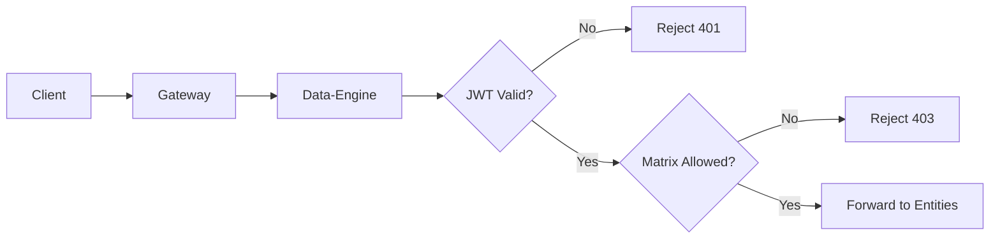

# Role-Based Access Control (RBAC)

Graphily implements a distributed and secure RBAC model. Authorization checks are performed in two distinct layers to ensure defense in depth: **Layer 1 (Data-Engine Preflight)** for early request gating and **Layer 2 (Entities Lifecycle Hooks)** for fine-grained row, field, and nested relation enforcement.

## Layer 1: Data-Engine Preflight (Early Gating)

**What it enforces**
- **App-State Gating:** Public vs Private app states (`GRAPHILY_APPLICATION_STATE`). See [Application State Gating](./application-state.md) for detailed flows.
- **Mutation Gating:** Global mutation enablement (`GRAPHILY_MUTATIONS_ENABLED`).
- **Top-Level Matrix Check:** Validates the primary operation against the access matrix (`GRAPHILY_ACCESS_MATRIX`). If the role lacks permissions for the top-level entity, the request is hard-denied (HTTP 401/403) before execution.
- **Field-Level Restrictions:** Applies `GRAPHILY_FIELD_PERMISSIONS` on the response JSON to strip out restricted fields based on the user's role.

**Flow**


**Detailed steps (code-backed)**
1. Data-Engine receives the request and decodes the JWT to extract `user_id` (from `sub`), `auth_profile`, and string `roles`. Integer `role_ids` are **not** read from the JWT — they are resolved at runtime by querying the database roles junction table keyed by `user_id`.
2. It evaluates app-level constraints (e.g., if app is private, only `builder` roles may bypass without a valid matrix).
3. The `matrix_crud_check` intercepts the request. It parses the top-level operation (e.g., `usersCreateOne` -> entity `users`, action `create`).
4. It compares the requested operation against the configured access matrix for the user's `role_ids` (and the public `-1` role fallback).
5. If denied, the request immediately returns an authorization error. If allowed, Data-Engine builds a `SecurityContext` and delegates to the Entities component.

## Layer 2: Entities Lifecycle Hooks (Inside Seaography)

**What it enforces**
- **Row-Level Security (RLS):** Automatically scopes queries to the user's tenant if `GRAPHILY_ROW_LEVEL_ENTITIES` is configured.
- **Permission Filters:** Applies fine-grained ABAC-style JSON permission filters from the access matrix as SQL `WHERE` conditions.
- **Nested Relation Soft-Deny:** The `entity_guard` hook intercepts nested entity selections in the GraphQL query. Unauthorized nested relations return `null` with an error, rather than failing the entire request.
- **Field Guards:** The `field_guard` hook blocks queries attempting to read sensitive credential columns (e.g., `password`, `cas_token`).
- **Table Lenses:** Injects default display filters (`GRAPHILY_LENSES`) for read operations.

**Flow**
```mermaid
flowchart LR
	A[Data-Engine] --> B[Entities (Seaography)]
	B --> C[entity_guard]
	B --> D[field_guard]
	B --> E[entity_filter]
	C --> F{Allowed?}
	D --> F
	F -- No --> G[Nullify & Error]
	F -- Yes --> H[Build SQL]
	E --> H
	H --> I[Execute via WitProxy]
```

**Detailed steps (code-backed)**
1. The `SecurityContext` injected by Data-Engine is accessed by `GraphilyFilterHook` inside Seaography.
2. For each requested entity, `entity_guard` checks the access matrix. If unauthorized (e.g., a restricted nested relationship), it returns a `Block` action.
3. `field_guard` inspects the requested columns and blocks access to configured password columns.
4. `entity_filter` dynamically builds SeaORM `Condition`s. It injects row-level filters (`$user_id` matching), combines any JSON permission filters attached to the role in the matrix, and appends `GRAPHILY_LENSES`.
5. User claims like `$user.<path>` in permission filters are replaced with actual values from the decoded JWT.

## Example Access Matrix Configuration

Graphily's access matrix is defined via the `GRAPHILY_ACCESS_MATRIX` environment variable as a JSON structure separating public and private rules:

```json
{
  "public": {
    "Post": { "read": true }
  },
  "private": {
    "Post": {
      "42": { 
        "read": { "status": { "eq": "published" } },
        "create": true 
      }
    }
  }
}
```

In this example:
- Unauthenticated users (public) can read all posts.
- Users with role ID `42` can only read posts where `status == 'published'`, and they are allowed to create new posts.

:::tip Matrix Combination
During evaluation, Graphily merges the `public` rules under a virtual `-1` role, allowing authenticated users to fall back to public permissions if their specific role lacks a directive.
:::
