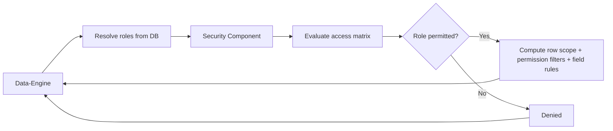
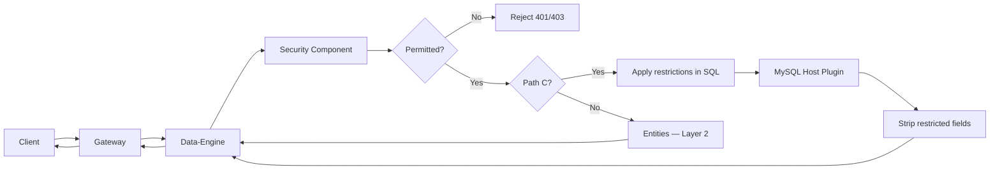
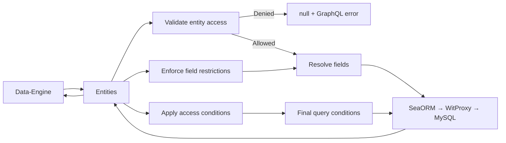

# Role-Based Access Control (RBAC)

Graphily's authorization model has three participants: the **Security Component** computes the authorization profile, the **Data-Engine** enforces it before any query runs and applies it directly in SQL for Path C operations, and the **Entities** layer enforces it inside Seaography resolvers for Path A/B queries.

1. **Security Component** — Evaluates the access matrix and produces the authorization profile for the request
2. **Layer 1** — Data-Engine Preflight (early request gating + Path C SQL enforcement)
3. **Layer 2** — Entities Lifecycle Hooks (Path A/B row, field, and nested-relation enforcement)

## Security Component: Authorization Profile

The Security component is the single source of truth for all authorization decisions in Graphily. Before any operation executes, Data-Engine calls the Security component to evaluate the access matrix and produce an authorization profile for the request. This profile is then applied at both enforcement layers.

**What it computes**
- Whether the entity and action (`read`, `create`, `update`, `delete`) are permitted for the user's roles
- Which rows the user is restricted to (row-level security scope)
- Which access conditions from the matrix apply (permission filters)
- Which fields the user is not allowed to read — merging credential defaults, global blocked field configuration, and per-model field permission rules
- Which fields the user is not allowed to write — merging credential defaults with global write-blocked field configuration

Roles are resolved from the database at runtime, not solely from the JWT, so the most current role assignment is always used. Unauthenticated users fall back to the public role defined in the matrix.

**Flow**


## Layer 1: Data-Engine Preflight

**What it enforces**
- **App-State Gating:** Enforces public vs. private application states. See [Authentication](./authentication.md) for details.
- **Mutation Gating:** Global enable/disable switch for all mutations.
- **Entity-Level Access:** If the Security component returns a denied profile, the request is rejected before any query runs.
- **Write-Field Restrictions:** Mutations that attempt to modify fields the user is not allowed to write are rejected immediately.
- **Path C Enforcement:** For operations that bypass Seaography (SimpleCrud, Aggregate, Recursive, Upsert, Reserve, Nested mutations), the authorization profile is applied directly in the generated SQL and restricted fields are removed from the response.
- **File Operation Exemption:** `generateFileUploadRequest` and `convertFileReference` are exempt from access matrix evaluation — they bypass RBAC entirely and are controlled only by app-state and authentication checks.

**Flow**


**Detailed steps (code-backed)**
1. Data-Engine decodes the JWT, extracts user claims, and resolves the user's role IDs from the database at runtime.
2. Data-Engine calls the Security component with the operation's entity, action, and resolved roles. The Security component evaluates the access matrix and returns the full authorization profile.
3. If the profile is denied, Data-Engine returns HTTP 401 (no token present) or HTTP 403 (authenticated but not permitted) immediately — nothing is forwarded.
4. For mutations, the input is checked against the write-restricted fields in the profile. Any restricted field in the payload returns HTTP 403.
5. For Path C operations, the authorization profile is applied in the SQL Data-Engine generates. The user only sees and affects the records they are permitted to access.
6. For Path A/B operations, the authorization profile is packed into the Security Context and forwarded to Entities.

**Example — Path C Aggregate with row-level security**
```graphql
query OrderCount {
  countOrder {
    count
  }
}
```
Data-Engine applies the authorization profile in the generated query, so the count reflects only the records the authenticated user is permitted to see.

## Layer 2: Entities Lifecycle Hooks (Path A/B)

This layer runs only for Path A (native Seaography) and Path B (non-native filter extension) requests. Path C bypasses Seaography entirely — hooks do not run on those paths.

**What it enforces**
- **Entity Guard:** Every entity in the response — including nested relations — is validated against the authorization profile. Unauthorized nested relations return `null` with a GraphQL error rather than failing the entire request.
- **Field Guard:** Blocks read access to credential columns and any fields restricted by the field permissions configuration.
- **Row-Level Security:** Queries are automatically scoped to the authenticated user's own records.
- **Permission Filters:** Access conditions defined in the access matrix are applied to every query.
- **User Claim Substitution:** Permission filter criteria can reference values from the authenticated user's JWT claims.
- **Table Lenses:** Default display filters are applied for read operations.

**Flow**


**Detailed steps (code-backed)**
1. The Security Context forwarded by Data-Engine is unpacked in Entities. It carries the authorization profile produced by the Security component.
2. For each entity being resolved — including nested relations — access is validated against the profile. Unauthorized relations are soft-denied: the field resolves to `null` and an error is appended to the GraphQL errors array without affecting the rest of the response.
3. Each requested field is checked against the restricted field list in the profile. Credential columns and any fields in the field permissions configuration are excluded from the response.
4. Row-level security and permission-based conditions from the profile are merged with table lenses and applied before the query executes.
5. SeaORM runs the final query via WitProxy and returns the scoped results.

**Example Query**
```graphql
query MyOrders {
  allOrder {
    totalCount
    results {
      id
      status
      total
    }
  }
}
```
If `Order` has row-level security enabled and the access matrix restricts results by status, both conditions are applied automatically — the response only contains records the authenticated user owns and is permitted to read.

## Access Matrix Structure

```json
{
  "public": {
    "Post": { "read": true }
  },
  "private": {
    "Post": {
      "42": {
        "read": { "status": { "eq": "published" } },
        "create": true
      }
    }
  }
}
```

The matrix separates `public` (unauthenticated) and `private` (role-based) rules. Public rules also act as a fallback for authenticated users whose role has no specific directive.

In this example:
- Unauthenticated users can read all posts.
- Users with role ID `42` can only read published posts and are permitted to create posts.

:::tip Row-Level Security
Set `GRAPHILY_ROW_LEVEL_ENTITIES` (comma-separated model names) and `GRAPHILY_ROW_LEVEL_COLUMN` (e.g., `user_id`) to enable automatic per-user record scoping for the listed entities.
:::

:::tip Field Permissions
Field permissions are configured per model and per field, specifying which roles are allowed to read that field. Any role not in the allowed list is blocked. An empty allowed list blocks all roles. This is applied on top of the default credential column block list.
:::
